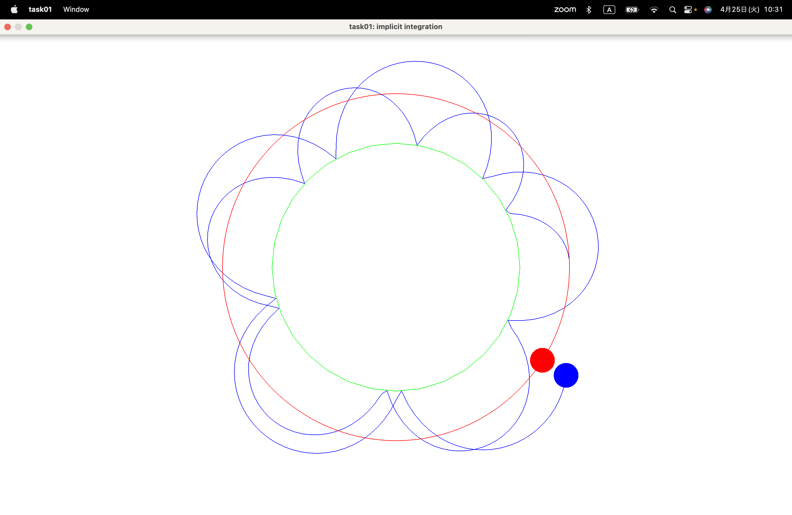
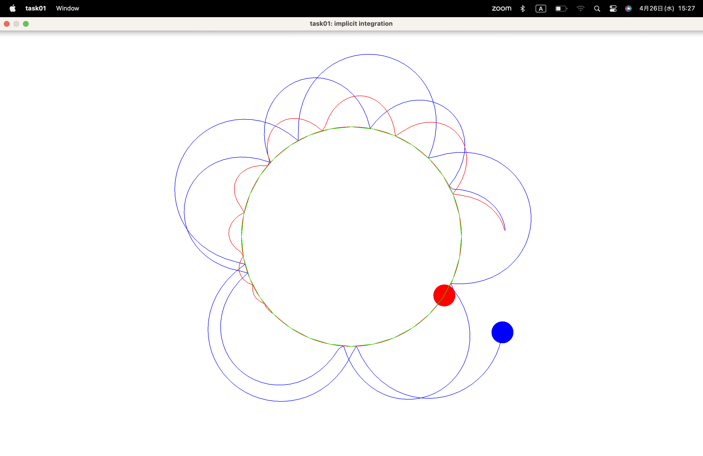

# Task01: Implicit Time Integration

**Deadline: Apr. 20th (Thu) at 15:00pm**

----

## Before Doing Assignment

If you have not done the [task00](../task00), do it first to set up the C++ graphics development environment.

Follow [this document](../doc/submit.md) to submit the assignment, In a nutshell, before doing the assignment,

- install `eigen` library following  [this document](../doc/setup_eigen.md)
- make sure you synchronized the `main ` branch of your local repository  to that of remote repository.
- make sure you created branch `task01` from `main` branch.
- make sure you are currently in the `task01` branch (use `git branch -a` command).

Now you are ready to go!

---

## Problem 1

1. Build the code using `cmake`
2. Run the code
3. Take a screenshot image (looks like image at the top)
4. Save the screenshot image overwriting `task01/problem1.png`

This program solves the equation of motion ${d^2 r}/{d t^2} = - {1}/{r^2}$ and visualize it in the polar coordinate, simulating the motion of small objects under gravity. The points bounce at the surface $r=0.5$. The movement of ***blue object*** is integrated using the ***Forward Time Integration***. Observe the energy gain artifact. 

## Problem 2

Modify the code at `line #43`  and `line #44` in [main.cpp](main.cpp) to integrate the equation of motion using the ***Backward(Implicit) Euler Method*** scheme for the movement of ***Red object***. 

Save the screenshot image overwriting `task01/problem2.png`

*Since the results for the red line were too far off from the blue line, I have also included the results with a smaller dt as a supplement to this assignment. (dt=0.00004f)

## After Doing the Assignment

After modifying the code, push the code and submit a pull request.

## Notes

- Do not submit multiple pull requests. Only the first pull request is graded
- Do not close the pull request by yourself. The instructor will close the pull request
- If you mistakenly merge the pull request, it's OK, but be careful not to merge next time. 

