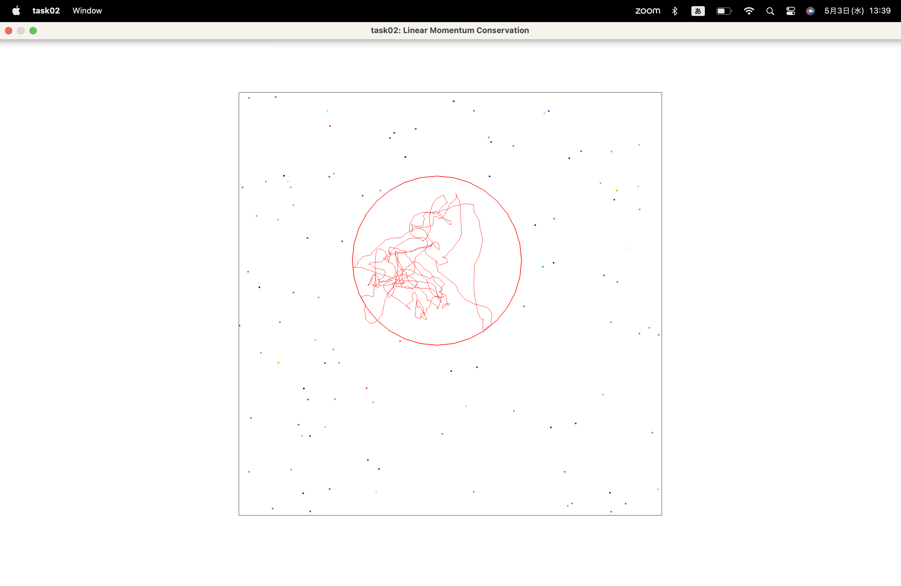

# Task02: Linear Momentum Conservation 

**Deadline: March 4th (Thu) at 15:00pm**

----

## Before Doing Assignment

If you have not done the [task00](../task00), do it first to set up the C++ graphics development environment.

Follow [this document](../doc/submit.md) to submit the assignment, In a nutshell, before doing the assignment,

- install `eigen` library following  [this document](../doc/setup_eigen.md)
- make sure you synchronized the `main ` branch of your local repository  to that of remote repository.
- make sure you created branch `task02` from `main` branch.
- make sure you are currently in the `task02` branch (use `git branch -a` command).

Now you are ready to go!

---

## Problem 1

1. Build the code using `cmake`
2. Run the code
3. Take a screenshot image (looks like image at the top)
4. Save the screenshot image overwriting `task02/problem1.png`

You will see many particles bump into a ball.

## Problem 2

Let's simulate [Brownian motion](https://en.wikipedia.org/wiki/Brownian_motion).  

Follow the instruction at `line #49`  in [main.cpp](main.cpp) to modify the code to simulate the collision between the ball and a particle. 

After running the program for a while, save the screenshot image overwriting `task02/problem2.png`

I did a little additional experimentation.
First, the random seed value is generated from the current time to avoid the same placement. Also, since the experiment time was short, I changed the time to 30,000 steps, which is 10 times the experiment time. The result is as follows.

Furthermore, the number of particles was low, so I set the number to 1,000. The result is as follows.

The more particles there are, the smaller the motion because many forces act from many directions.

## After Doing the Assignment

After modifying the code, push the code and submit a pull request.

## Notes

- Do not submit multiple pull requests. Only the first pull request is graded
- Do not close the pull request by yourself. The instructor will close the pull request
- If you mistakenly merge the pull request, it's OK, but be careful not to merge next time. 

